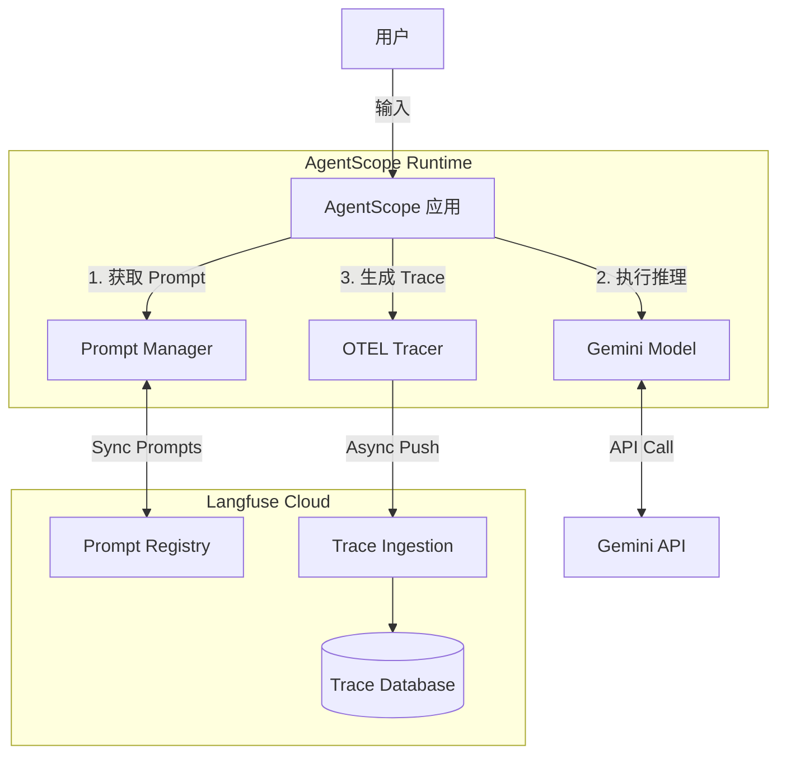

# AgentScope 与 Langfuse 集成技术实施计划书

## 1. AgentScope与Langfuse集成架构设计

### 1.1 当前代码结构分析与集成点识别

基于对 `main.py` 的分析，当前的 AgentScope 应用是一个基于 `ReActAgent` 的单体应用，使用了 `GeminiChatModel` 和自定义补丁。

**关键模块识别：**
*   **入口点**：`main.py` 中的 `creating_react_agent` 函数和 `asyncio.run` 调用。
*   **模型层**：`GeminiChatModel` (位于 `agentscope.model`)，负责与 LLM 交互。
*   **代理层**：`ReActAgent` (位于 `agentscope.agent`)，负责任务规划和执行。
*   **工具层**：`Toolkit` (位于 `agentscope.tool`)，负责工具调用。

**集成策略：**
AgentScope 原生支持 OpenTelemetry (OTEL) 协议，而 Langfuse 兼容 OTEL。因此，集成将主要通过 `agentscope.init()` 函数配置 `tracing_url` 来实现，无需大规模修改业务逻辑代码。

### 1.2 Langfuse SDK 集成方案

**API 密钥配置：**
采用环境变量管理敏感信息，避免硬编码。
*   `LANGFUSE_PUBLIC_KEY`: Langfuse 项目公钥
*   `LANGFUSE_SECRET_KEY`: Langfuse 项目私钥
*   `LANGFUSE_HOST`: Langfuse 服务地址 (SaaS版为 `https://cloud.langfuse.com`，私有部署为自定义域名)

**初始化流程设计：**
在应用启动的最早阶段（`main.py` 的 `if __name__ == "__main__":` 块或 `asyncio.run` 之前）注入初始化代码。

```python
import agentscope
import os
import base64

def init_tracing():
    """初始化 Langfuse 追踪"""
    # 获取环境变量
    public_key = os.environ.get("LANGFUSE_PUBLIC_KEY")
    secret_key = os.environ.get("LANGFUSE_SECRET_KEY")
    host = os.environ.get("LANGFUSE_HOST", "https://cloud.langfuse.com")
    
    if not (public_key and secret_key):
        print("警告: 未检测到 Langfuse 密钥，跳过追踪初始化。")
        return

    # 构建 Auth Header (Langfuse 要求 Basic Auth 格式)
    auth_string = f"{public_key}:{secret_key}"
    auth_header = base64.b64encode(auth_string.encode("utf-8")).decode("ascii")
    
    # 设置 OTEL Header
    os.environ["OTEL_EXPORTER_OTLP_HEADERS"] = f"Authorization=Basic {auth_header}"
    
    # 构建 Tracing URL (注意: Langfuse OTEL 端点路径为 /api/public/otel/v1/traces)
    tracing_url = f"{host.rstrip('/')}/api/public/otel/v1/traces"
    
    # 初始化 AgentScope
    agentscope.init(
        project="AgentScope-Research",
        name="ReAct-Agent-Demo",
        tracing_url=tracing_url,
        save_api_invoke=True  # 保存 API 调用详情
    )
```

### 1.3 数据采集规范

定义需要追踪的关键指标，确保可观测性：

| 指标类别 | 具体指标 | 采集方式 | 用途 |
| :--- | :--- | :--- | :--- |
| **基础元数据** | Trace ID, Span ID, Parent ID | 自动采集 | 调用链追踪 |
| **性能指标** | Latency (响应时间) | 自动采集 (Start/End time) | 性能瓶颈分析 |
| **成本指标** | Token Usage (Input/Output/Total) | 模型层自动上报 | 成本核算与优化 |
| **质量指标** | Model Parameters (Temp, TopP) | 自动采集 | 实验配置记录 |
| **错误指标** | Error Level, Exception Message | 自动采集 + 手动埋点 | 异常监控与排查 |
| **业务指标** | User Feedback (Score/Comment) | 需额外集成 Feedback API | 响应质量评估 |
| **输入输出** | Prompt, Completion | 自动采集 (需开启 `save_api_invoke`) | 内容审计与调试 |

---

## 2. Prompt管理系统化实施方案

### 2.1 Prompt 版本控制机制

利用 Langfuse 的 Prompt Management 功能实现版本控制：
*   **命名规范**：`{模块名}_{功能名}_{版本号}` (例如: `react_agent_system_prompt_v1`)
*   **版本策略**：
    *   `Production`: 线上稳定版
    *   `Staging`: 测试验证版
    *   `Latest`: 开发中最新版
*   **生命周期**：Draft -> Review -> Staging -> Production -> Archived

### 2.2 Prompt 模板库设计

建立标准化的 JSON/YAML 模板结构，并通过 Langfuse SDK 管理。

**模板结构示例：**
```json
{
  "name": "react_agent_system_prompt",
  "type": "chat",
  "messages": [
    {
      "role": "system",
      "content": "你是一个名为 {{agent_name}} 的智能助手。你的性格是 {{personality}}。"
    },
    {
      "role": "user",
      "content": "{{user_input}}"
    }
  ],
  "config": {
    "temperature": 0.7,
    "model": "gemini-2.5-flash"
  },
  "variables": ["agent_name", "personality", "user_input"]
}
```

### 2.3 动态加载机制 (Langfuse -> AgentScope)

实现 `PromptManager` 类，封装 Langfuse SDK 的 `get_prompt` 方法，支持缓存和运行时更新。

```python
from langfuse import Langfuse

class PromptManager:
    def __init__(self):
        self.langfuse = Langfuse()
        self._cache = {}

    def get_prompt(self, prompt_name, version="production", cache_ttl=300):
        # 实现带缓存的获取逻辑
        # ...
        prompt = self.langfuse.get_prompt(prompt_name, version=version)
        return prompt.compile
```

### 2.4 Prompt A/B 测试框架

利用 Langfuse 的 Trace Tags 和 Prompt Config 实现 A/B 测试：
1.  **分组策略**：根据 User ID 哈希或随机数分配 `experiment_group` (A/B)。
2.  **动态路由**：根据分组加载不同版本的 Prompt (`v1` vs `v2`)。
3.  **数据关联**：在 Trace 中通过 `tags` 标记实验组别 (`experiment: v2`)。
4.  **效果评估**：在 Langfuse Dashboard 对比不同 tag 的 Score 和 Latency。

---

## 3. 技术实现路线图

### 第一阶段：基础集成 (预计耗时: 1-2天)
*   [ ] 配置本地开发环境，安装 `langfuse` SDK。
*   [ ] 申请 Langfuse Cloud 账号并获取 Keys。
*   [ ] 编写 `tracing_utils.py` 封装初始化逻辑。
*   [ ] 修改 `main.py` 引入追踪初始化。
*   [ ] 验证 Trace 数据是否成功上报至 Langfuse 控制台。

### 第二阶段：Prompt 管理 (预计耗时: 2-3天)
*   [ ] 在 Langfuse 后台创建并录入现有 Prompt。
*   [ ] 开发 `PromptManager` 模块，替换代码中的硬编码 Prompt。
*   [ ] 实现 Prompt 动态参数填充逻辑。
*   [ ] 建立 Prompt 更新发布流程文档。

### 第三阶段：高级功能 (预计耗时: 2-3天)
*   [ ] 集成 Langfuse Score API，实现用户反馈收集（可选）。
*   [ ] 配置 Langfuse Dataset，用于自动化测试评估。
*   [ ] 设置异常监控告警规则（如错误率 > 1% 触发邮件）。
*   [ ] 性能基准测试与优化。

---

## 4. 操作指南文档要求

### 4.1 配置文件模板 (`.env.example`)

```bash
# AgentScope 配置
GEMINI_API_KEY=your_gemini_key_here

# Langfuse 配置
LANGFUSE_PUBLIC_KEY=pk-lf-...
LANGFUSE_SECRET_KEY=sk-lf-...
LANGFUSE_HOST=https://cloud.langfuse.com
```

### 4.2 部署手册 (Step-by-Step)

**开发环境：**
1.  复制 `.env.example` 为 `.env` 并填入真实 Key。
2.  安装依赖：`pip install langfuse agentscope`。
3.  运行应用：`python main.py`。
4.  查看控制台日志确认 "Tracing enabled"。

**生产环境：**
1.  在 CI/CD 流水线中配置环境变量。
2.  确保网络策略允许访问 `cloud.langfuse.com` (443端口)。
3.  建议使用异步非阻塞模式发送 Trace 数据（AgentScope 默认支持）。

### 4.3 故障排查清单

| 现象 | 可能原因 | 解决方案 |
| :--- | :--- | :--- |
| **Trace 未显示** | API Key 错误 / Host 不可达 | 检查环境变量；测试 `curl` 连通性 |
| **Auth Error (401)** | Basic Auth 格式错误 | 确认 `agentscope.init` 中 Header 构造逻辑 |
| **Missing Spans** | 异步上下文丢失 | 确保使用 `asyncio.run` 且装饰器正确使用 |
| **Latency 过高** | 网络延迟 | 检查是否开启了同步发送，建议使用 Batch 处理 |

### 4.4 验证测试用例

1.  **连通性测试**：运行 `python main.py`，断言 Langfuse 后台出现新的 Trace。
2.  **结构完整性**：检查 Trace 详情页，确认包含 `System Prompt`, `User Input`, `Model Output`, `Token Usage`。
3.  **错误捕获**：故意传入无效 API Key 触发异常，确认 Trace 中显示红色 Error 状态及堆栈信息。

---

## 5. 交付标准

1.  **代码质量**：
    *   新增代码通过 `pylint` / `flake8` 检查。
    *   单元测试覆盖率 > 80% (针对 `PromptManager` 等新模块)。
2.  **文档完整性**：
    *   本计划书归档至 `docs/`。
    *   架构图清晰表达数据流向。
3.  **性能指标**：
    *   集成 Trace 后，单次请求端到端延迟增加不超过 5% 或 100ms（以大者为准）。
    *   内存占用增加不超过 50MB。
4.  **持续集成**：
    *   Git Commit 记录需关联 Prompt 版本变更（如果 Prompt 存在代码库中）。

---

## 附录：架构示意图 (Mermaid)


